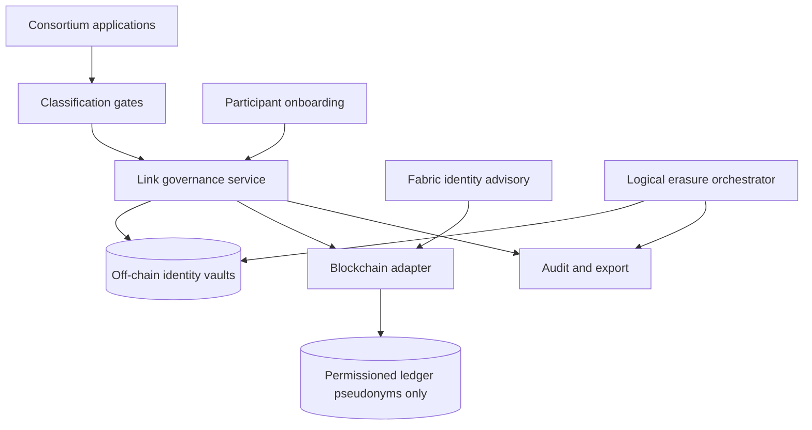

# Aliaskeep

**Source:** `ai-in-decentralized+ai/GNQZVQR3/`
**Domain:** `ai-decentralized`
**One-liner:** A pseudonymisation-link governance platform for permissioned blockchain consortia that keeps EU personal data off-chain while consortium members can still grant access, prove audit trails, and execute logical erasure by revoking links.
**Wedge:** Hyperledger Fabric consortia in supply chain, trade finance, and healthcare where architects already chose pseudonymisation but lack a governed system of record for off-chain identity vaults, link allocation, and accidental-PD gates before transactions hit the ledger.
**Positioning:** Consortium privacy link ops. IBM's GDPR-for-blockchain whitepaper argues distribution, immutability, and permanence conflict with erasure and minimisation; encryption and full anonymisation are insufficient; the durable pattern is pseudonymisation with off-chain identifiers and rigorous governance of links for access and logical erasure. Aliaskeep is that governance layer — distinct from Forgetcase (Article 17 case desk), Erasuremesh (processor erasure mesh), and Offhash (Fabric field-level architecture guard).

## Market research synthesis

### Thesis from source

The IBM Security whitepaper "GDPR considerations for blockchain solution architects" treats GDPR (effective 25 May 2018) as imposing stringent requirements on any company that collects, stores, or processes data about EU data subjects, regardless of where systems run. Penalties reach four percent of global revenue or €20 million. The document focuses on three blockchain properties that create special GDPR tension: distribution (records replicated among participants across regulatory regions), immutability (cryptographic hashing makes modification or deletion infeasible once data is on-chain), and permanence (append-only storage conflicts with data minimisation and retention limits, and with lawful-basis withdrawal).

The paper's summarising challenge is stark: without distribution, immutability, and permanence, a blockchain loses much of its value — yet those same properties make GDPR compliance difficult when personal data lands on-chain. Avoiding personal data entirely is the simplest path but impracticable for most projects. Anonymisation before storage faces a high re-identification bar under GDPR (cost, time, and available technology must be considered), and incomplete anonymisation indefinitely exposes underlying data. Encryption on-chain still stores personal data permanently, with future break or key-disclosure risk that supervisory authorities may reject.

The recommended approach is pseudonymisation: personal identifiers maintained off-chain with a controlled mechanism linking back to on-chain pseudonyms. Deleting those links provides fine-grained access control and "logical erasure" — irreversibly anonymising on-chain data once off-chain identifiers are destroyed. Pseudonymised data remains personal data under GDPR until links are deleted; therefore architects need demonstrable, auditable controls over link allocation and erasure, plus governance over what content may enter the chain at all. The paper calls out comment fields, document uploads, and API payloads as channels where accidental personal data (including scanned PDFs) can reach the ledger without selective redaction.

Technical footnotes extend the governance problem to Hyperledger Fabric: X.509 certificate attributes embedded in transactions can carry personal data permanently; Identity Mixer zero-knowledge credentials (Fabric 1.2+) allow selective attribute disclosure as an alternative; channels and private-data patterns limit replication but do not replace link governance. The conclusion: pseudonymisation plus robust business governance — not technology alone — sustains GDPR compliance on permissioned chains.

### Buyer & economic model

- **Primary buyer:** consortium privacy lead or solution architect co-sponsored by the consortium DPO and the network operator (e.g., IBM-style managed Fabric operator or internal platform team).
- **Users:** blockchain solution architects, identity administrators, channel operators, integration engineers wiring APIs and document uploads, privacy counsel reviewing erasure proofs, consortium onboarding managers vetting new participants across jurisdictions.
- **Budget owner / value metric:** consortium platform and compliance budget; value metric is demonstrable logical-erasure SLA, reduction in blocked transactions due to accidental PD, and audit-ready link-governance evidence that avoids stop-processing orders.
- **Competing status quo:** ad hoc spreadsheets mapping pseudonyms to CRM records, manual certificate attribute scrubbing, legal memos without runtime enforcement, and post-hoc discovery that comment fields wrote PD on-chain.

### Domain constraints

- **Regulatory / trust / safety:** GDPR Articles on access, rectification, and erasure; controller/processor role clarity across consortium members; cross-border participant onboarding; special-category data rules; pseudonymised on-chain data remains in scope until links are deleted.
- **Data sensitivity:** off-chain identity vaults hold the re-identification keys — the highest-sensitivity tier; on-chain pseudonyms and transaction metadata are lower sensitivity but still personal data when linkable.
- **Change-management realities:** consortia cannot halt production for a privacy rebuild; Aliaskeep must gate new writes and govern links on live channels while legacy PD-bearing entries are remediated through separate Offhash or Forgetcase workflows.

## Business requirements

- BR-1: Every on-chain pseudonym must map to exactly one governed off-chain identity vault record, with no orphan or duplicate links across consortium members.
- BR-2: Access to re-identify a pseudonym must be allocated through policy (role, channel, lawful basis, contract) and revoked automatically when lawful basis expires or erasure is ordered.
- BR-3: Logical erasure must delete or irreversibly destroy off-chain link material and produce an auditable certificate that the on-chain pseudonym can no longer be attributed to a data subject.
- BR-4: Content submitted through APIs, comments, and document uploads must pass classification gates that block or quarantine probable personal data before it reaches the blockchain adapter.
- BR-5: Participant onboarding must record jurisdiction, controller/processor role, and channel membership before link allocation is permitted.
- BR-6: Hyperledger Fabric deployments must flag X.509 certificate attributes that embed personal data and recommend Identity Mixer or attribute-stripped enrollment paths.
- BR-7: Cross-consortium erasure requests must propagate link revocation to all participants holding copies of the link metadata within a defined SLA.
- BR-8: Privacy counsel must receive exportable evidence tying each live link to purpose, retention intent, and last access event.
- BR-9: Accidental PD detection must support human review queues with hold on chain write until remediated or explicitly waived with documented risk acceptance.
- BR-10: The platform must distinguish logical erasure (link deletion → anonymisation) from access suspension (temporary revocation without destroying identifiers).
- BR-11: Integration adapters must document to end users how uploaded files and free-text fields will be stored relative to the chain.
- BR-12: Consortium operators must be able to demonstrate that no participant can unilaterally recreate deleted links from on-chain data alone.

## User stories

Canonical user stories live in sibling [USER_STORIES.md](USER_STORIES.md).

## System design

### Overview

Aliaskeep sits between consortium applications and the permissioned blockchain adapter. Applications propose transactions with pseudonymous identifiers only; Aliaskeep validates content, resolves link policies, and authorises or denies writes. Off-chain identity vaults hold personal identifiers and link metadata; the link governance service allocates, audits, and revokes access; logical erasure destroys link rows and emits anonymisation proofs. Classification gates inspect free text, attachments, and API JSON before endorsement. Fabric-specific modules advise on certificate attribute handling and channel-scoped link visibility.

### Actors & boundaries

- **Actors:** consortium members (controllers/processors), privacy architect, channel operator, integration engineer, privacy counsel, onboarding manager, end data subject (via controller), Aliaskeep operator.
- **Trust boundary:** personal identifiers never cross into the blockchain adapter; only pseudonyms and policy tokens do. Link vaults sit in controller-controlled storage with Aliaskeep holding governance metadata and audit logs.
- **Human-in-the-loop points:** classification quarantine review; erasure approval for disputed links; onboarding jurisdiction attestation; policy changes affecting cross-border sharing.

### Core capabilities

1. **Identity vault registry** — off-chain vault records bound to on-chain pseudonyms per consortium policy.
2. **Link allocation and revocation** — fine-grained access to re-identify, with lawful-basis and channel scope.
3. **Logical erasure orchestration** — link destruction, anonymisation proof, participant notification.
4. **Content classification gates** — PD detection on comments, uploads, and API payloads pre-endorsement.
5. **Participant onboarding controls** — jurisdiction, role, and channel membership before link rights.
6. **Fabric identity advisory** — X.509 attribute risk flags and Identity Mixer credential path guidance.
7. **Cross-participant link sync** — propagate revocations and erasures across consortium metadata stores.
8. **Audit and regulatory export** — link history, access events, erasure certificates.

### Conceptual data

- **Primary entities:** Consortium, Participant, IdentityVault, Pseudonym, LinkPolicy, LinkGrant, LogicalErasure, ClassificationScan, QuarantineItem, FabricIdentityProfile, ErasureCertificate, AccessAuditEvent.
- **Critical events:** pseudonym minted, link granted, link revoked, content quarantined, logical erasure completed, participant onboarded, certificate attribute flagged.
- **Retention / audit needs:** link grants and erasure certificates retained for accountability windows; personal identifiers retained only in vaults under controller retention policy; classification scan artifacts retained for dispute resolution.

### Integrations (conceptual)

- **Systems of record:** Hyperledger Fabric (or other permissioned chain) endorsement pipeline, enterprise IAM, CRM/master data holding subject identifiers, document management for uploads.
- **Upstream signals:** transaction proposals, file uploads, enrollment CSR attributes, erasure requests from Forgetcase or DSR portals.
- **Downstream actions:** allow/deny endorse, vault link delete, participant webhook on revocation, audit export to GRC tools, advisory hooks to Offhash for field-level blocking.

### High-level architecture

### Success metrics

- **Leading:** share of transaction proposals passing classification without quarantine; median time from erasure request to link destruction; percentage of pseudonyms with documented lawful basis; Fabric enrollments using attribute-stripped or ZK credentials.
- **Lagging:** supervisory audit findings related to on-chain personal data; count of remediated accidental PD incidents; cross-participant erasure completion rate within SLA; consortium member retention after privacy incidents.

## OpenAPI skeleton

Canonical HTTP surface lives in sibling [openapi.yaml](openapi.yaml). Summary:

- **Base path:** `/v1/...`
- **Auth:** `X-API-Key` for blockchain adapter and classification integrations; Bearer JWT for consortium operators and privacy counsel.
- **Resource groups:** Vaults, Links, Erasures, Classification, Participants, Reporting.
