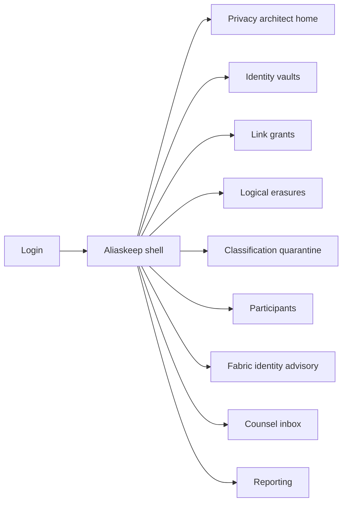
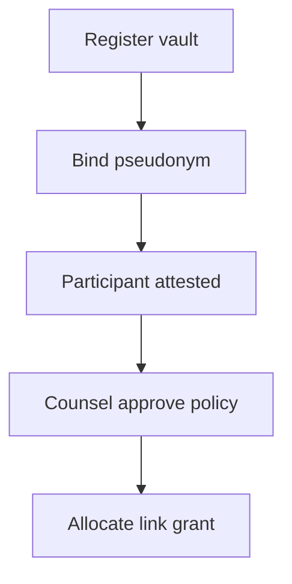

# Aliaskeep — Web app

**Product:** [PRODUCT.md](./PRODUCT.md)
**Primary surface:** Consortium privacy link governance console (privacy architect + channel operator shell)
**Secondary surfaces:** Privacy counsel approval inbox; read-only erasure certificate viewer for supervisory packs
**Design thesis:** Aliaskeep is the lockbox for re-identification keys — the UI metaphor is a keyed vault register beside a sealed ledger, not a blockchain explorer and not a generic DSR portal. Visual language is cold graphite and link-cyan on a deep charcoal ground: live links glow provisional; destroyed links render as broken seals with anonymisation certificates; quarantine items feel like packages held at customs. The Aliaskeep wordmark sits as a quiet key-mark on every link-bearing screen so counsel knows whose logical erasure they are attesting.

## UX research synthesis

### Category peers (best-in-class)

- **BigID / Collibra Data Privacy:** Pseudonym catalogues, lawful-basis binding, and erasure evidence packs. Steal: every live link shows purpose + retention intent + last access; reject sprawling data-catalog browsing as the daily home.
- **Hyperledger Fabric Operations Console / Cello-style ops:** Channel membership and peer health next to identity enrollment. Steal: Fabric enrollment risk flags beside participant cards; reject raw MSP dumps as the primary UX.
- **OneTrust / TrustArc DSR desks:** Erasure request lifecycle with certificates. Steal: logical erasure vs access suspension as distinct states (BR-10); reject consumer-complaint ticket aesthetics for consortium architects.
- **Nightfall / private-data collection patterns (conceptual UX):** Off-chain payload with on-chain commitment. Steal: “what never crossed the adapter” attestation on write gates.

### Patterns to adopt / reject

- **Adopt:** Vault↔pseudonym 1:1 register; link grant with channel + lawful basis; classification quarantine before endorse; Fabric X.509 attribute risk banner; cross-participant revocation SLA clock; erasure certificate export; explicit waiver for low-confidence scans.
- **Reject:** Spreadsheet upload as the system of record; explorers as home; “delete from blockchain” language; auto-approve uploads when confidence is low; purple AI privacy score; editable audit history.

### Trust, density, and workflow constraints from PRODUCT.md

Pseudonymised on-chain data remains personal until links die (source thesis) — so the console never treats “on-chain only” as anonymous. Accidental PD in comments/PDFs must hold writes (BR-4, BR-9). Onboarding blocks link allocation until jurisdiction and roles are attested (BR-5). Counsel needs exportable evidence per live link (BR-8). Operators must prove no participant can unilaterally recreate deleted links (BR-12). Density is architect-grade: tables of grants and scans, not marketing KPI tiles.

## Information architecture

### Nav model

### Roles → default home

| Role | Default home | Why |
|------|--------------|-----|
| Privacy architect | Privacy architect home | Vault/link health and erasure SLA |
| Channel operator | Classification quarantine | Stop accidental PD before endorse (BR-4) |
| Integration engineer | Fabric identity advisory | Strip X.509 PD (BR-6) |
| Privacy counsel | Counsel inbox | Approve policies and review certificates (BR-8) |
| Onboarding manager | Participants | Block links until jurisdiction/roles (BR-5) |
| Platform admin | Classification quarantine | Negative-path holds (BR-9) |

### Cross-links to OpenAPI resources

| Nav area | OpenAPI tags / resources |
|----------|---------------------------|
| Identity vaults | Vaults |
| Link grants / revoke | Links |
| Logical erasures | Erasures |
| Classification quarantine | Classification |
| Participants | Participants |
| Reporting / certificates | Reporting |

## Screen inventory

### Privacy architect home

- **Purpose:** Answer “are links governed, and is erasure SLA at risk?” in one composition.
- **Entry:** Architect login default.
- **Layout regions:** Brand + consortium switcher; live-link count vs vaults; erasure-in-flight SLA strip; quarantine backlog; Fabric enrollment risk summary; alerts rail.
- **Primary actions:** Open at-risk erasure; open quarantine; export counsel pack.
- **Empty / loading / error:** Empty consortium = onboard first participant; loading = skeletons; error = retry + request id.
- **BR / story ties:** BR-1, BR-7, BR-8.

### Identity vault registry

- **Purpose:** Enforce one governed off-chain vault per on-chain pseudonym — no orphans/duplicates.
- **Entry:** Nav → Vaults.
- **Layout regions:** Vault table (pseudonym, controller, jurisdiction); duplicate/orphan detectors; detail drawer with link history summary (no raw PD dump by default).
- **Primary actions:** Register vault; bind pseudonym; flag duplicate for merge review.
- **Empty / loading / error:** Empty = register first vault; conflict = coral duplicate banner.
- **BR / story ties:** BR-1.

### Link grant and revoke

- **Purpose:** Allocate re-identification access by role, channel, lawful basis, and contract; revoke on expiry/erasure.
- **Entry:** Nav → Links; from vault detail.
- **Layout regions:** Grant table; policy editor (channel, basis, retention intent); auto-revoke rules; last access event.
- **Primary actions:** Create grant; revoke; submit policy to counsel approval.
- **Empty / loading / error:** No participant attestation = create blocked (BR-5).
- **BR / story ties:** BR-2, BR-5, BR-8.

### Logical erasure workspace

- **Purpose:** Destroy link material, emit anonymisation certificate, notify participants — distinct from access suspension.
- **Entry:** Nav → Erasures; DSR handoff.
- **Layout regions:** Request queue; link graph of holders; destroy confirm; certificate preview; suspension-only toggle clearly labeled secondary.
- **Primary actions:** Execute logical erasure; export certificate; notify members.
- **Empty / loading / error:** Empty = no open erasures; partial propagation = SLA breach amber.
- **BR / story ties:** BR-3, BR-7, BR-10, BR-12.

### Classification quarantine

- **Purpose:** Hold API/comment/upload content with probable PD before blockchain adapter.
- **Entry:** Operator default; alert deep links.
- **Layout regions:** Quarantine queue (confidence, channel, field path); payload preview redacted; remediate / waive-with-risk / reject; hold-on-write banner.
- **Primary actions:** Remediate; explicit waiver with documented risk; reject write.
- **Empty / loading / error:** Empty = healthy “no holds”; low confidence never auto-passes (BR-9).
- **BR / story ties:** BR-4, BR-9, BR-11.

### Upload storage disclosure

- **Purpose:** Document to integrators how files and free text are stored relative to the chain.
- **Entry:** From classification settings; integration docs panel.
- **Layout regions:** Field→storage map (off-chain vault / hash-only / blocked); end-user disclosure text templates.
- **Primary actions:** Publish disclosure; require ack on adapter config.
- **Empty / loading / error:** Undocumented field = cannot enable write path.
- **BR / story ties:** BR-11.

### Participant onboarding

- **Purpose:** Record jurisdiction, controller/processor role, channel membership before any link allocation.
- **Entry:** Nav → Participants.
- **Layout regions:** Onboarding checklist; role attestation; channel membership; link-rights locked until complete.
- **Primary actions:** Approve onboarding; revoke participant rights.
- **Empty / loading / error:** Incomplete = lock icon on Links nav.
- **BR / story ties:** BR-5.

### Fabric identity advisory

- **Purpose:** Flag X.509 attributes embedding PD; recommend Identity Mixer or stripped enrollment.
- **Entry:** Nav → Fabric; enrollment webhook.
- **Layout regions:** Enrollment profile list; attribute risk matrix; recommended path; advisory status to adapter.
- **Primary actions:** Flag enrollment; require strip/ZK; export advisory for ops.
- **Empty / loading / error:** No Fabric org = hide module with “not configured.”
- **BR / story ties:** BR-6.

### Counsel inbox

- **Purpose:** Approve cross-border link policies and review erasure certificates before supervisory response.
- **Entry:** Counsel login default.
- **Layout regions:** Pending policy approvals; certificate queue; objection/notice checklist.
- **Primary actions:** Approve/reject policy; download certificate pack.
- **Empty / loading / error:** Empty = “no pending counsel actions.”
- **BR / story ties:** BR-8; counsel stories.

### Cross-participant revocation monitor

- **Purpose:** Prove erasure/revocation propagated to all holders within SLA; show no unilateral link recreation.
- **Entry:** From erasure detail; Reporting.
- **Layout regions:** Participant ack matrix; SLA countdown; recreation-attempt alerts.
- **Primary actions:** Nudge lagging member; open incident.
- **Empty / loading / error:** Ack incomplete = amber; recreation attempt = coral block.
- **BR / story ties:** BR-7, BR-12.

### Reporting and regulatory export

- **Purpose:** Export link history, access events, and erasure certificates for GRC.
- **Entry:** Nav → Reporting.
- **Layout regions:** Filter by subject/pseudonym/period; job list; machine-readable pack.
- **Primary actions:** Generate export; share secure link.
- **Empty / loading / error:** Job fail = retry + support id.
- **BR / story ties:** BR-8.

### Access suspension (non-erasure)

- **Purpose:** Temporarily revoke re-identification without destroying identifiers — clearly labeled vs logical erasure.
- **Entry:** Link detail → Suspend.
- **Layout regions:** Suspension reason; restore path; warning that this is not anonymisation.
- **Primary actions:** Suspend; restore; convert to logical erasure.
- **Empty / loading / error:** N/A.
- **BR / story ties:** BR-10.

## Key flows

1. **Governed link allocate** — vault bind → participant attested → counsel-approved policy → grant → access audited; failure: missing jurisdiction blocks grant.

2. **Pre-endorse PD gate** — proposal/upload → classify → quarantine if probable PD → remediate/waive/reject → allow adapter only if clear (BR-4, BR-9).

3. **Logical erasure** — request → map holders → destroy links → certificate → propagate SLA → prove no recreation (BR-3, BR-7, BR-12).

4. **Fabric enrollment harden** — CSR attributes scanned → PD flag → strip or Identity Mixer path → enroll (BR-6).

5. **Access suspend vs erase** — operator chooses suspend (temporary) or logical erase (destroy); UI forbids conflating labels (BR-10).

## Design system

### Tokens (CSS variables)

- `--color-ink: #E8EDF2` — primary text
- `--color-charcoal-950: #0C0F14` — app ground
- `--color-charcoal-900: #151A22` — panels
- `--color-graphite: #8A96A5` — secondary labels
- `--color-link: #2EC4B6` — live link accent (link-cyan)
- `--color-link-dim: #1A6F68` — cyan on dark
- `--color-amber: #E0A12B` — quarantine / SLA risk
- `--color-coral: #E85D4C` — PD hold / recreation attempt
- `--color-seal: #9AA4B2` — destroyed link / broken seal
- `--color-brand: #7FE7DC` — Aliaskeep wordmark
- `--font-display: "Space Grotesk", sans-serif` — console titles / KPIs
- `--font-mono: "IBM Plex Mono", monospace` — pseudonyms, vault ids, certificates
- `--font-body: "IBM Plex Sans", sans-serif`
- `--space-1`…`--space-8`: 4px scale
- `--radius-sm: 4px`; `--radius-md: 6px` — sharp vault aesthetic
- `--motion-break-seal: 220ms ease-in` — link destroy animation
- `--motion-hold: 300ms ease-in-out` — quarantine amber pulse
- Atmosphere: subtle lock-grid texture in charcoal-900; soft top vignette; no stock “blockchain cubes.”

### Typography & brand

- Grotesk display for architect home KPIs; mono for pseudonyms and certificate hashes.
- Brand key-mark left of chrome on vault/link/erasure screens; never replaced by generic “Dashboard.”
- Login: brand hero, one headline (“Govern the link — erase by destroying it”), one CTA.

### Do / don’t

- **Do:** Separate logical erasure from suspension visually; hold writes on quarantine; show holder ack matrix; mono pseudonyms only (no names in tables by default).
- **Don’t:** Purple AI glow; “delete blockchain” copy; auto-pass low-confidence scans; card grids for static compliance metrics; emoji status.

### Accessibility & domain trust cues

- AA+ on cyan/amber/coral vs charcoal; destroyed state uses broken-seal icon + “Anonymised” text.
- Live regions announce quarantine holds and SLA breaches.
- Focus order: vault → grant → quarantine → erasure → certificate.
- Certificates machine-readable for counsel export.

## Component patterns

- **PseudonymVaultRow** — 1:1 bind status, orphan/duplicate flags.
- **LinkGrantPolicyForm** — channel, lawful basis, retention, auto-revoke.
- **BrokenSealCertificate** — logical erasure proof artifact.
- **ClassificationHoldBanner** — write blocked until remediate/waive.
- **RiskWaiverDialog** — documented acceptance for low-confidence override.
- **ParticipantAttestationLock** — blocks link nav until complete.
- **FabricAttributeRiskMatrix** — X.509 PD flags + recommended path.
- **PropagationAckGrid** — cross-participant erasure SLA.

## Out of scope for v1 web

- Full Fabric peer/orderer ops console; consumer DSR self-service portal; Forgetcase Article 17 case desk replacement; Offhash field-level chaincode IDE; mobile-native operator apps; public-chain explorers.
